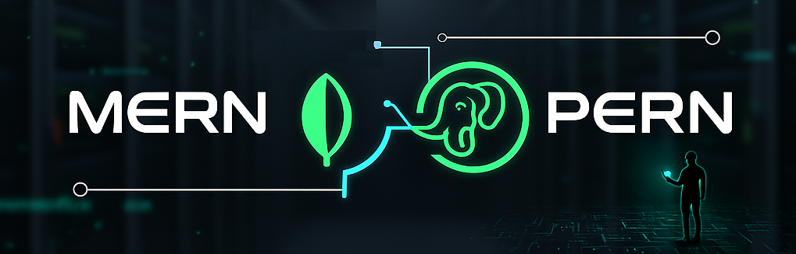

# 👋 ¡Hola! Soy Victor Salazar Del Toro  
### 💻 Full Stack Developer | MERN & PERN Stack  

Soy un **desarrollador full stack** apasionado por construir aplicaciones web completas, rápidas y escalables.  
Trabajo principalmente con los stacks **MERN** (MongoDB, Express, React, Node.js) y **PERN** (PostgreSQL, Express, React, Node.js), aplicando buenas prácticas de desarrollo y arquitectura limpia.  

---

## 🚀 Tecnologías y herramientas
**Frontend:** React · Vite · TailwindCSS  
**Backend:** Node.js · Express  
**Base de datos:** PostgreSQL · MongoDB  
**Otros:** Firebase · AWS S3 · Socket.io · Jest · Git · Docker (básico)

---

## 🧩 Proyectos Destacados  

### 📝 [Blog Web](https://victorsalazarportfolio.netlify.app/#projects)
Plataforma de blogging interactiva que permite crear, editar y compartir artículos con multimedia.  
Incluye comentarios en tiempo real, notificaciones instantáneas y manejo de archivos con AWS S3.  
**Stack:** React, TailwindCSS, Node.js, Express, PostgreSQL, Firebase, AWS S3, Socket.IO

---

### 🐶 [VetApp](https://victorsalazarportfolio.netlify.app/#projects)
Aplicación web para registrar y hacer seguimiento de visitas veterinarias.  
Permite gestionar historiales de mascotas con CRUD completo y autenticación de usuarios.  
**Stack:** React, Node.js, Express, PostgreSQL, TailwindCSS  

---

### 💼 [Animora Pet Portfolio](https://victorsalazarportfolio.netlify.app/)
Mi portfolio personal, desarrollado con **React + Vite**, para presentar mis proyectos y habilidades de forma clara, moderna y responsive.  

---

### 💰 [CriptoQuote](https://victorsalazarportfolio.netlify.app/#projects)
Cotizador de criptomonedas en tiempo real con interfaz limpia y diseño responsive.  
**Stack:** React, TailwindCSS, API pública de cotización de criptos.  

---

## 🧠 Sobre mí  
- Me motiva aprender tecnologías nuevas y mejorar cada proyecto que construyo.  
- Disfruto escribir código limpio y entender cómo cada parte del sistema se comunica.  
- Actualmente busco mi **primer rol profesional como Full Stack Developer**, donde pueda aportar mis conocimientos y seguir creciendo junto a un equipo técnico.

---

## 📈 Estadísticas de GitHub  

  

---

## 📬 Conectemos  

  
  

---

⭐️ *“El mejor código es el que hace que la experiencia del usuario parezca simple.”*  
